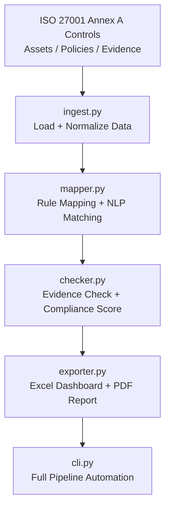

<p align="center">
  
  
  
  
  
</p>

<p align="center">
  <a href="https://www.linkedin.com/in/syed-shahmikh-ali-6b962b201/">
    
  </a>
</p>

# ISO 27001 Compliance Automation Engine (Python)

A fully automated ISO 27001 Annex A compliance tool that:

- Maps ISO 27001 controls to policies and evidence  
- Uses NLP (difflib similarity) to match controls ↔ policies  
- Checks evidence availability  
- Calculates compliance & risk-weighted scores  
- Exports Excel dashboards (with charts)  
- Generates professional PDF summaries  
- Includes a CLI tool to run the entire pipeline  

This project demonstrates **Security Consulting + Automation**, exactly what modern cyber roles require.

---

# 🚀 Features

### ✔ Automated Control Mapping  
Maps ISO 27001 Annex A controls → required evidence + policies  
Uses NLP to find best matching policy text.

### ✔ Evidence Checking  
Validates:
- Required evidence types (config, asset inventory, logs, etc)
- Required policies
- Missing items detection
- Generates remediation suggestions

### ✔ Compliance Scoring  
- Compliant / Partially Compliant / Not Compliant  
- Risk-weighted scoring for high-impact controls  
- Exported as `results.json` and `gaps.csv`

### ✔ Excel Dashboard (exporter.py)  
Builds `report.xlsx` containing:  
- Summary sheet  
- Controls sheet  
- Mappings sheet  
- Gaps sheet  
- Charts sheet (auto-generated bar charts)

### ✔ PDF Summary  
Professional one-page summary:  
- Timestamp  
- Compliance %  
- Weighted compliance %  
- Breakdown table  
Perfect for auditors or LinkedIn screenshots.

### ✔ Full CLI Support  
Run everything in one command:

```bash
python src/cli.py run-all
````

---

# 📁 Project Structure

```
iso27001-automation/
│
├── data/
│   ├── iso27001_annexA.json
│   ├── control_requirements.json
│   ├── assets.csv
│   ├── evidence_index.json
│   ├── risk_register.csv
│   ├── mappings.csv
│   ├── gaps.csv
│   ├── results.json
│   ├── report.xlsx
│   └── summary.pdf
│
├── policies/
│   ├── acceptable_use.txt
│   └── data_protection.txt
│
├── src/
│   ├── ingest.py
│   ├── mapper.py
│   ├── nlp_matcher.py
│   ├── checker.py
│   ├── exporter.py
│   └── cli.py
│
├── README.md
└── requirements.txt
```

---

# 🧩 Architecture Diagram (Mermaid)



---

# 📊 Output Examples

### Excel Dashboard

* Compliance chart
* Weighted compliance chart
* Full mapping
* Evidence gaps

### PDF Summary (1-page)

* Professional audit-style layout
* Perfect for screenshots

---

# 🛠 Installation

```bash
git clone https://github.com/<your-username>/<your-repo>.git
cd iso27001-automation

python3 -m venv venv
source venv/bin/activate       # Windows: venv\Scripts\activate

pip install -r requirements.txt
```

---

# ▶️ Usage

### Run entire pipeline:

```bash
python src/cli.py run-all
```

### Or step-by-step:

```bash
python src/cli.py ingest
python src/cli.py map
python src/cli.py check
python src/cli.py export
```

---

# 🌱 Roadmap (Next Features)

* Add ISO 27017 Cloud Controls
* Add ISO 27018 Privacy Controls
* Add Flask UI dashboard
* Integrate real cloud configs (AWS, Azure)
* Automatic evidence collection
* SOC alert → control mapping

---

# 🙌 Author

**Shahmikh Ali**
Security Consultant | Python Automation | Compliance Engineer

If you like this project, ⭐ **star the repo** and connect with me on LinkedIn.

```
https://www.linkedin.com/in/syed-shahmikh-ali-6b962b201/
